<p align="center">
  <br/><br/>
  Tiny symmetric encryption that may run everywhere.<br/><br/>
</p>

[](https://github.com/Artem-Shapovalov/encodex/actions/workflows/testing.yml)
[](https://github.com/Artem-Shapovalov/encodex/actions/workflows/ansi_compliance.yml)
[](https://github.com/Artem-Shapovalov/encodex/actions/workflows/misra_compliance.yml)

| Compiler          | Build | Text | Data | BSS  |
|-------------------|-------|------|------|------|
| gcc               | [](https://github.com/Artem-Shapovalov/encodex/actions/workflows/gcc_build.yml) | 1796 |    4 |    0 |
| clang             | [](https://github.com/Artem-Shapovalov/encodex/actions/workflows/clang_build.yml) | 1410 |    0 |    0 |
| arm-none-eabi-gcc | [](https://github.com/Artem-Shapovalov/encodex/actions/workflows/arm_build.yml) | 1168 |    4 |    0 |
| avr-gcc           | [](https://github.com/Artem-Shapovalov/encodex/actions/workflows/avr_build.yml) | 1946 |    4 |    0 |
| riscv64-linux-gnu | [](https://github.com/Artem-Shapovalov/encodex/actions/workflows/risc_v_build.yml) | 2044 |    4 |    0 |
| mips-linux-gnu    | [](https://github.com/Artem-Shapovalov/encodex/actions/workflows/Mips_check.yml) | 1936 |    4 |    0 |

# DISCLAIMER
All locks protect only from honest people. Besides this cypher is good enough it may be broken. It's not certified, use it at your own risk. I doing all to decrease your risks.

# Algorithm

ENCODEX is a lightweight and fast block cipher symmetrical key algorithm. The goal is to effectively cipher text in a single round, this why it may be used on low-performance devices. It operates 256-bit blocks and 256-bit keys. The source of entropy is a simple shifting pseudo-random generator.

The algorithm consists of next operations:

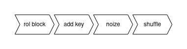

- RoL block: cyclic rotate each byte according the key.
- Add key: add key bytes to block bytes with overflow.
- Full-block RoL: cyclic rotate the whole 256-bit block.
- Noize: XOR all bytes with a pseudo-random sequence.
- Feistel layer: cross-mix 128-bit halves with a reversible Feistel-like layer.
- Shuffle: permutate bytes in the block in chaotic order.

| Stage              | Image 1 ECB                                | Image 1 CBC                                    | Image 2 ECB                              | Image 2 CBC                                  |
|--------------------|--------------------------------------------|------------------------------------------------|------------------------------------------|----------------------------------------------|
| Initial state      |                 |                     |                 |                     |
| RoL block          |       |       | 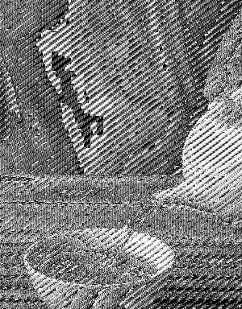      | 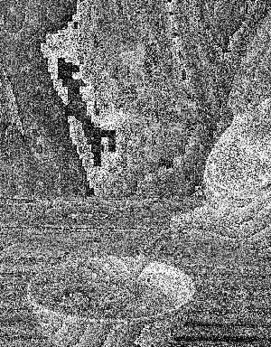      |
| Add key            |         |         |         |         |
| Full-block RoL     |  | 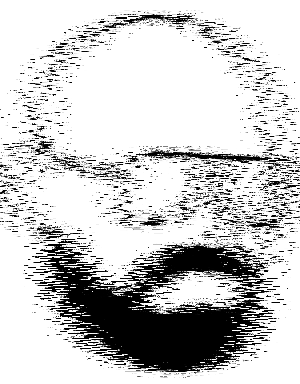 |  |  |
| Noize              | 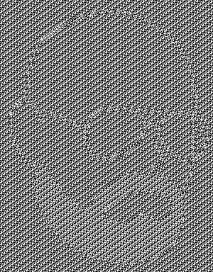          |           | 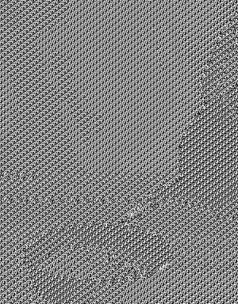          |           |
| Feistel layer      | 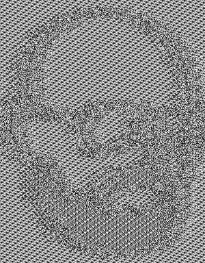        |         | 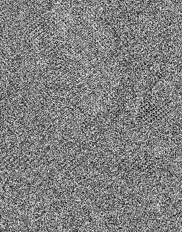        |         |
| Shuffle            | 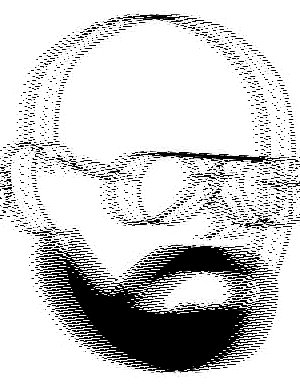        | 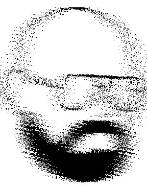        |         |         |

CBC mode is simple, it's such a pseudo-random key regeneration, this why you easily may encode and decode series of blocks in forward direction.

Each step of the algorithm is iterating throught the bytes or bits of the input block and performs some revertable operations.

## RoL block

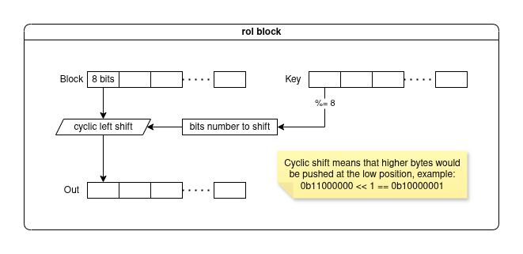

Each byte of the block is cyclically shifted for the corresponding byte of the key.

## Add key

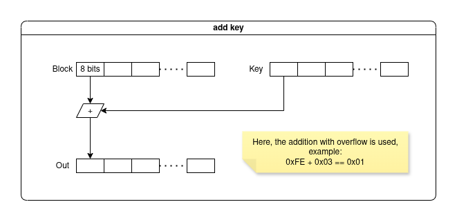

To each byte of the block adds corresponding byte of the key with overflowing.

## Full-block RoL

The full 256-bit block is cyclically shifted by a key-derived amount. This moves bits across byte boundaries before later byte-oriented steps.

## Noize

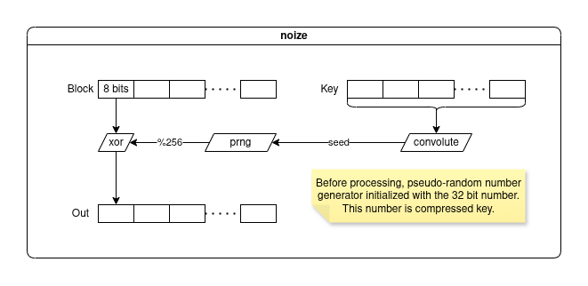

Here, each byte of the block XOR-ed with the random number. Random number generator initialized with the convolution of the key.

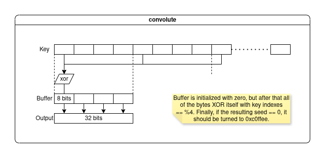

The key XOR-ed with itself in the loop. For example, first byte of the output seed convolutes with the 1, 4, 8, 12, 16, 20, 24, 28, and 32 bytes of the key.

## Feistel layer

The block is split into two 128-bit halves. The first half is XOR-ed with a function of the second half, then the second half is XOR-ed with a function of the updated first half. Decryption applies the same operations in reverse order.

## Shuffle

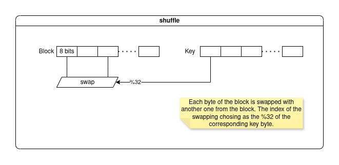

This step permutates bytes of the block. In the loop each byte swaps with the other byte of the block. Index of the other byte to swap is corresponding key byte % 32.

# Visualization

The example files are raw 300 x 384 8-bit grayscale images. The project includes a small PNG generator that can rebuild the Encodex visual artifacts:

```sh
make docs-images
```

## Cipher comparison

Visual demonstration of each algorithm is much more comprehensive than just a raw data dumps. The table below compares ECB-style output for Encodex, DES and AES-256 on the same raw grayscale inputs.

| Source | Encodex | DES ECB | AES-256 ECB |
|--------|---------|---------|-------------|
|  | 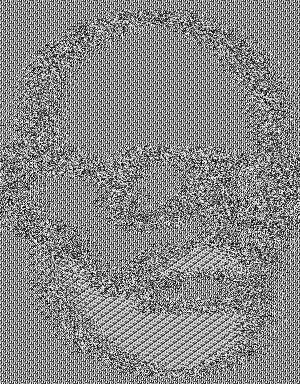 | 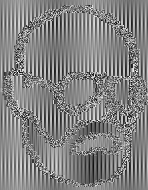 | 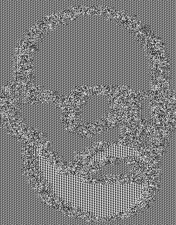 |
|  | 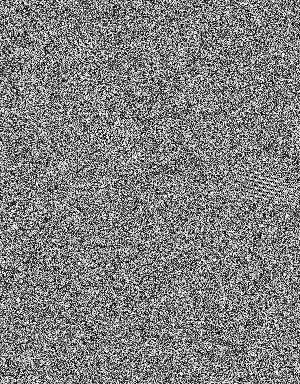 | 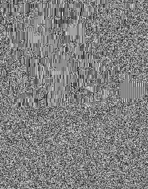 | 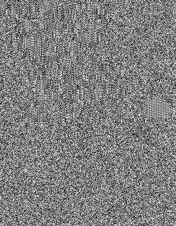 |

## Isolated Encodex steps

Each image below is produced by applying one isolated Encodex step to the source data. The final column shows the full `encodex()` result.

| Source | Byte ROL | Add key | Full-block ROL |
|--------|----------|---------|----------------|
|  |  |  |  |
|  |  |  |  |

| Noise | Feistel layer | Shuffle | Full Encodex |
|-------|---------------|---------|--------------|
|  |  |  |  |
|  |  |  |  |

## CBC-style isolated steps

These images apply the same isolated steps while evolving the key with the project's CBC-style key update between blocks.

| Source | Byte ROL CBC | Add key CBC | Full-block ROL CBC |
|--------|--------------|-------------|--------------------|
|  |  |  |  |
|  |  |  |  |

| Noise CBC | Feistel CBC | Shuffle CBC | Full Encodex CBC |
|-----------|-------------|-------------|------------------|
|  |  |  |  |
|  |  |  |  |

# Usage

This algorithm is not certified at all, but it checked statically with MISRA C 2012 rules. It does not have any dependencies except C standard library. It needed for standard integer types. This code is written with ISO/ANSI C maneer and tested for compliance. This way you may use it in any project with any hardware.

To embed it in your project, just copy encodex.h and encodex.c and add it to your build system. Follow the doxygen comments in header file. Take a look on example application and tests.

# Security analytics

Encodex is a compact educational cipher, not a modern security primitive. The single-block transform is reversible and intentionally simple. Older versions had weak byte diffusion: a plaintext byte mostly affected one ciphertext byte after a final byte permutation. The current version adds a full-block bit rotation and a Feistel-like cross-half layer to make those byte-independent attacks fail, while keeping the code readable.

Run the included attack probes with:

```sh
make breaks
```

| Probe | Attacker access | What is checked | Current result | Risk factors |
|-------|-----------------|-----------------|----------------|--------------|
| `break/chosen_plaintext.c` | Can ask an encoder to encrypt synthetic blocks under an unknown key | Tries the old byte-codebook attack | Fails against the current cross-byte layer | Public encryption endpoint, device API that encrypts attacker-controlled data, reused key |
| `break/known_plaintext.c` | Has several plaintext/ciphertext block pairs, but no encoder access | Tries to fit the old independent per-byte decryptor | Fails/inconclusive against the current cross-byte layer | File headers, predictable records, reused packet templates, old plaintext copies |
| `break/mitm_validator.c` | Active man-in-the-middle can modify packets and observe receiver accept/reject | Tries the old two-byte mutation search with a fixed query budget | No accepted mutation found within the budget | No authentication tag, receiver leaks validation result, retries tolerate invalid packets |
| Ciphertext-only with no validator | Only passively observes opaque ciphertext | No universal break is implemented | Not reliably decryptable from ciphertext alone | Low redundancy, no oracle, no known structure |

## How to reduce these risks with Encodex

The safest fix is still to replace Encodex with reviewed authenticated encryption. If Encodex must be used because of size, portability, or legacy constraints, the surrounding protocol should avoid the exact conditions used by the demos.

These mitigations reduce practical risk, but they do not prove Encodex secure or turn it into a modern authenticated cipher.

| Risk | Encodex-specific mitigation | Why it helps | Limitation |
|------|-----------------------------|--------------|------------|
| Chosen-plaintext oracle | Do not expose an API, command, or service that encrypts attacker-controlled blocks with the production key. Use a separate test key for diagnostics. | Prevents the `break/chosen_plaintext.c` codebook attack from collecting synthetic encryptions. | Does not protect against known plaintext already present in real traffic. |
| Key reuse across many predictable packets | Rotate session keys often. Derive a per-session or per-message Encodex key outside Encodex from a master key and a nonce/counter. | Limits how much traffic an attacker can analyze under one effective key. | Key derivation must be done with a real KDF or MAC, not with ad hoc XOR. |
| Predictable plaintext layout | Avoid encrypting fixed headers, magic bytes, constant fields, or repeated templates directly under the same key. Put routing headers outside encryption, and include random padding inside encrypted blocks. | Reduces known-plaintext material available to attackers. | Random padding helps only if it is unpredictable and authenticated. |
| Passive capture of old messages | Add monotonically increasing counters, session IDs, and short key lifetimes. Refuse replayed counters. | Prevents old valid ciphertext from being reused as a fresh command. | Replay protection does not provide confidentiality by itself. |
| Active MITM packet mutation | Authenticate every encrypted packet with a separate tag before acting on decrypted content. If a full MAC is too expensive, even a keyed tag is better than a public checksum. | Stops accepted forged packets like `break/mitm_validator.c`, because modified ciphertext fails authentication before validation. | A public CRC/checksum is not enough; the attacker can search for packets that still validate. |
| Validator oracle | Make receiver failures quiet and expensive: return one generic error, do not reveal which field failed, add backoff after invalid packets, and temporarily stop exchange after repeated damaged packets. | Increases the cost of MITM search. Delay or lockout turns repeated damaged packets into a slow, visible attack. | Rate limiting slows the attack, but does not cryptographically prevent it. A patient attacker may still succeed. |
| Unlimited invalid packet attempts | Count invalid packets per peer/session and force re-handshake or key rotation after a small threshold. | Prevents an attacker from trying thousands of mutations under the same key and receiver state. | Needs reliable state and a recovery path for noisy links. |
| Different behavior for malformed packets | Validate authentication first, then decrypt, then perform protocol validation with uniform timing and uniform failure behavior where possible. | Reduces side-channel feedback available to a MITM. | Hard to make perfect on small devices, but even coarse uniform behavior helps. |
| Structural cipher risk | Keep the full-block rotation and Feistel-like layer enabled, and add more rounds if size allows. | Preserves cross-byte diffusion so old byte-independent attacks stay invalid. | More rounds improve confidence but still do not replace public cryptographic review. |

Round-trip tests prove only that decryption reverses encryption. They do not prove confidentiality, integrity, resistance to known plaintext, or resistance to chosen plaintext.
