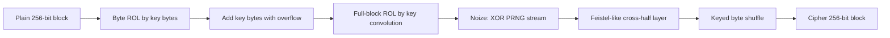
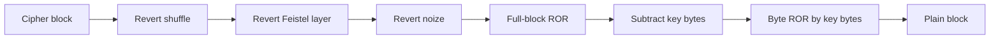
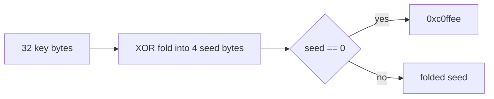
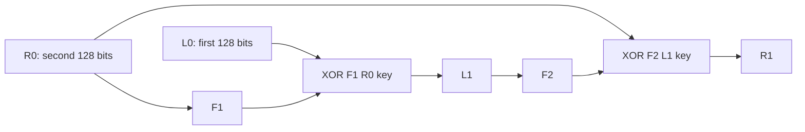
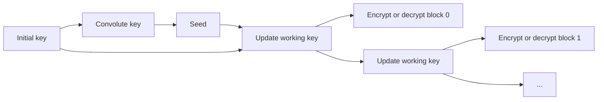

# Encodex

Tiny symmetric encryption that may run everywhere.

[](https://github.com/Artem-Shapovalov/encodex/actions/workflows/testing.yml)
[](https://github.com/Artem-Shapovalov/encodex/actions/workflows/ansi_compliance.yml)
[](https://github.com/Artem-Shapovalov/encodex/actions/workflows/misra_compliance.yml)

| Compiler          | Build | Text | Data | BSS |
|-------------------|-------|------|------|-----|
| gcc               | [](https://github.com/Artem-Shapovalov/encodex/actions/workflows/gcc_build.yml) | 1796 | 4 | 0 |
| clang             | [](https://github.com/Artem-Shapovalov/encodex/actions/workflows/clang_build.yml) | 1410 | 0 | 0 |
| arm-none-eabi-gcc | [](https://github.com/Artem-Shapovalov/encodex/actions/workflows/arm_build.yml) | 1168 | 4 | 0 |
| avr-gcc           | [](https://github.com/Artem-Shapovalov/encodex/actions/workflows/avr_build.yml) | 1946 | 4 | 0 |
| riscv64-linux-gnu | [](https://github.com/Artem-Shapovalov/encodex/actions/workflows/risc_v_build.yml) | 2044 | 4 | 0 |
| mips-linux-gnu    | [](https://github.com/Artem-Shapovalov/encodex/actions/workflows/Mips_check.yml) | 1936 | 4 | 0 |

# Disclaimer

Encodex is not a certified cipher. It is an educational, compact block cipher
experiment for constrained C environments. Use it at your own risk.

# Algorithm

Encodex encrypts one 256-bit block with one 256-bit key. The current single
round keeps the original simple reversible primitives, but adds two diffusion
steps that the old description did not include: a full-block bit rotation and a
Feistel-like cross-half layer.


```mermaid
flowchart LR
    P[Plain 256-bit block] --> B[Byte ROL by key bytes]
    B --> A[Add key bytes with overflow]
    A --> R[Full-block ROL by key convolution]
    R --> N[Noize: XOR PRNG stream]
    N --> F[Feistel-like cross-half layer]
    F --> S[Keyed byte shuffle]
    S --> C[Cipher 256-bit block]
```

Decryption applies the inverse operations in reverse order:


```mermaid
flowchart LR
    C[Cipher block] --> RS[Revert shuffle]
    RS --> RF[Revert Feistel layer]
    RF --> RN[Revert noize]
    RN --> RR[Full-block ROR]
    RR --> RA[Subtract key bytes]
    RA --> RB[Byte ROR by key bytes]
    RB --> P[Plain block]
```

## Steps

| Step | Purpose | Reverted by |
|------|---------|-------------|
| Byte ROL | Rotates each byte by the matching key byte modulo 8. | Byte ROR |
| Add key | Adds each key byte to the matching block byte with unsigned overflow. | Subtract key |
| Full-block ROL | Rotates all 256 bits as one block so bits cross byte boundaries. | Full-block ROR |
| Noize | XORs bytes with a PRNG stream seeded by key convolution. | Same XOR stream in reverse |
| Feistel layer | Mixes the two 128-bit halves through reversible XOR updates. | Same functions in reverse order |
| Shuffle | Swaps byte positions according to key bytes modulo 32. | Reverse-order swaps |

## Key Convolution

The PRNG seed and full-block rotation amount are derived by XOR-folding the
32-byte key into one `uint32_t`. If the result is zero, the default seed
`0xc0ffee` is used.


```mermaid
flowchart LR
    K[32 key bytes] --> X[XOR fold into 4 seed bytes]
    X --> Z{seed == 0}
    Z -- yes --> D[0xc0ffee]
    Z -- no --> S[folded seed]
```

## Feistel-Like Layer

The Feistel layer is intentionally small. It is not a full multi-round Feistel
cipher, but it breaks the old byte-independent structure by making each half
depend on the other half.


```mermaid
flowchart LR
    L0[L0: first 128 bits] --> X1[XOR F1 R0 key]
    R0[R0: second 128 bits] --> F1[F1]
    F1 --> X1
    X1 --> L1[L1]
    L1 --> F2[F2]
    R0 --> X2[XOR F2 L1 key]
    F2 --> X2
    X2 --> R1[R1]
```

Encryption:

```text
L1 = L0 XOR F1(R0, key)
R1 = R0 XOR F2(L1, key)
```

Decryption:

```text
R0 = R1 XOR F2(L1, key)
L0 = L1 XOR F1(R0, key)
```

## CBC-Style Mode

Encodex CBC mode is not standard CBC with an IV. It is a forward-only key
evolution mode: before each block, the working key is updated by a PRNG stream
derived from the previous seed.


```mermaid
flowchart LR
    K0[Initial key] --> C0[Convolute key]
    C0 --> S0[Seed]
    S0 --> U1[Update working key]
    K0 --> U1
    U1 --> E1[Encrypt or decrypt block 0]
    U1 --> U2[Update working key]
    U2 --> E2[Encrypt or decrypt block 1]
    U2 --> U3[...]
```

# Visualization

All documentation bitmap images below are generated from raw 300 x 384 8-bit
grayscale data by `docs/visualizer.c`.

```sh
make docs-images
```

## Cipher Comparison

| Source | Encodex | DES ECB | AES-256 ECB |
|--------|---------|---------|-------------|
|  |  |  |  |
|  |  |  |  |

## Isolated Encodex Steps

Each isolated-step image applies one operation to the source data. The full
Encodex column applies the complete `encodex()` function.

| Source | Byte ROL | Add key | Full-block ROL | Noize |
|--------|----------|---------|----------------|-------|
|  |  |  |  |  |
|  |  |  |  |  |

| Feistel layer | Shuffle | Full Encodex | Full Encodex with CBC-style key update |
|---------------|---------|--------------|----------------------------------------|
|  |  |  |  |
|  |  |  |  |

# Usage

Encodex has no dependencies except the C standard integer and size types. To
embed it in a project, copy `encodex.h` and `encodex.c` into the build and use
the API documented in the header. The example CLI in `example/app.c` shows file
encoding and decoding.

Common commands:

```sh
make test
make breaks
make docs-images
```

# Security Analytics

Encodex is still an educational cipher, not a modern authenticated encryption
scheme. The old byte-independent attacks are kept as regression probes.

| Probe | Attacker access | What is checked | Current result | Risk factors |
|-------|-----------------|-----------------|----------------|--------------|
| `break/chosen_plaintext.c` | Can ask an encoder to encrypt synthetic blocks under an unknown key | Tries the old byte-codebook attack | Fails against the current cross-byte layer | Public encryption endpoint, attacker-controlled encryption input, reused key |
| `break/known_plaintext.c` | Has plaintext/ciphertext block pairs, but no encoder access | Tries to fit the old independent per-byte decryptor | Fails/inconclusive against the current cross-byte layer | File headers, predictable records, reused packet templates |
| `break/mitm_validator.c` | Can modify packets and observe receiver accept/reject | Tries the old two-byte mutation search with a fixed query budget | No accepted mutation found within the budget | No authentication tag, receiver leaks validation result |
| Ciphertext-only with no validator | Only passively observes opaque ciphertext | No universal break is implemented | Not reliably decryptable from ciphertext alone | Low redundancy, no oracle, no known structure |

## Reducing Risk Around Encodex

These mitigations reduce practical risk, but they do not prove Encodex secure or
turn it into a modern authenticated cipher.

| Risk | Encodex-specific mitigation | Limitation |
|------|-----------------------------|------------|
| Chosen-plaintext oracle | Do not expose production-key encryption of attacker-controlled blocks. Use separate diagnostic keys. | Does not remove known plaintext already present in traffic. |
| Key reuse | Rotate session keys and derive per-session or per-message keys outside Encodex. | Key derivation must use a real KDF or MAC, not ad hoc XOR. |
| Predictable plaintext | Keep fixed routing headers outside encryption and add unpredictable padding inside encrypted blocks. | Padding helps only when unpredictable and authenticated. |
| Active packet mutation | Authenticate every encrypted packet before acting on decrypted content. | Public CRC/checksum is not enough. |
| Validator oracle | Return one generic error, add invalid-packet backoff, and temporarily stop exchange after repeated damaged packets. | Rate limiting slows attacks, but does not cryptographically prevent them. |
| Replay | Add counters/session IDs and reject old counters. | Replay protection does not provide confidentiality by itself. |

Round-trip tests prove only that decryption reverses encryption. They do not
prove confidentiality, integrity, resistance to known plaintext, or resistance
to chosen plaintext.
