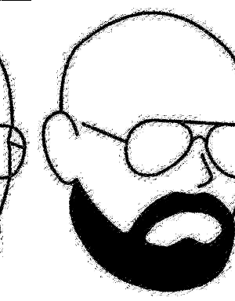
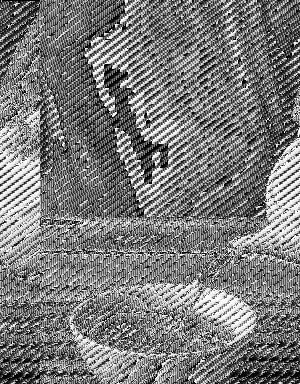
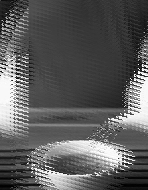

    
  Tiny symmetric encryption that may run everywhere.  

| Compiler          | Build | Text | Data | BSS  |
|-------------------|-------|------|------|------|
| gcc               |  | 1796 |    4 |    0 |
| clang             |  | 1410 |    0 |    0 |
| arm-none-eabi-gcc |  | 1168 |    4 |    0 |
| avr-gcc           |  | 1946 |    4 |    0 |
| riscv64-linux-gnu |  | 2044 |    4 |    0 |
| mips-linux-gnu    |  | 1936 |    4 |    0 |

# DISCLAIMER
All locks protect only from honest people. Besides this cypher is good enough it may be broken. It's not certified, use it at your own risk. I doing all to decrease your risks.

# Algorithm

ENCODEX is a lightweight and fast block cipher symmetrical key algorithm. The goal is to effectively cipher text in a single round, this why it may be effectively used on a low-performance devices. It operates 256 bytes blocks and keys. The source of entropy is a simple shifting pseudo-random generator.

The algorithm consists of next operations:

- RoL block: cyclic rotate bytes according the key.
- Add key: adding with overflow bytes of the key to the block.
- Noize: XOR with pseudo-random sequence all of the bytes.
- Shuffle: permutate bytes in the block in chaotic order.

| Stage         | Image 1                               | Image 2                             |
|---------------|---------------------------------------|-------------------------------------|
| Initial state |            |            |
| RoL block     |  |  |
| Add key       |    |    |
| Noize         |      |      |
| Shuffle       |    |    |

CBC mode is simple, it's such a pseudo-random key regeneration, this why you easily may encode and decode series of blocks in forward direction.

# Comparsion

Visual demonstration of each algorithm is much more comprehensive than just a raw data dumps. All three algorithms are conjuncted with permutations and each have some advantages and disadvantages with different kinds of the images.

ENCODEX shuffles image not so good as DES and AES because it works with a single round, but it works better with the monochrome images, because it distorts the data and equalizes probability of appearing of distorted data. This why, the portrait almost disappears in the repeating patter. Also, besides the pattern is repeating in all of three cases, you may notice that difference of color of encoded black and white for AES and DES, but ENCODEX have no visual difference between encoded black and white.

ENCODEX weaker in grayscale images because of visible patterns, but it still good enough, you can't identify teapot or cup. It's a product of a single round limitation.

CBC mode is good for all three ciphers and looks like a white noize.

| Mode | DES                                 | Encodex                                 | AES                                 |
|------|-------------------------------------|-----------------------------------------|-------------------------------------|
| ECB  |      |      |      |
| CBC  |  |  |  |
| ECB  |        |        |        |
| CBC  |    |    |    |

# Usage

This algorithm is not certified at all, but it checked statically with MISRA C 2012 rules. It does not have any dependencies except C standard library. It needed for standard integer types. This code is written with ISO/ANSI C maneer and tested for compliance. This way you may use it in any project with any hardware.

To embed it in your project, just copy encodex.h and encodex.c and add it to your build system. Follow the doxygen comments in header file. Take a look on example application and tests.
